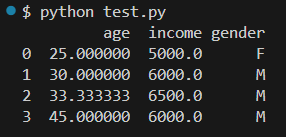
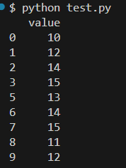
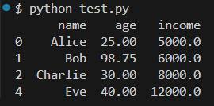

# DATA - 250327

# 데이터 정제 (Data Cleaning)

## 데이터 정제란?
"Garbage in, garbage out."  
- 분석에 사용할 데이터가 부정확하거나 누락되거나 이상치가 많다면, 모든 분석 결과는 신뢰할 수 없게 된다.  
- 데이터 정제는 데이터 분석의 가장 중요한 기초 작업   

## 1. 데이터 개념 정리

| 용어 | 정의 | 예시 |
|------|------|------|
| Data (데이터) | 측정 또는 관찰된 사실의 수치적 표현 | 170cm, 남성, 서울 |
| Unit (단위체) | 데이터를 수집하는 대상의 최소 단위 | 1명의 고객 |
| Observation (관측값) | 하나의 unit에 대한 전체 데이터 집합 (1행) | 고객 A: 남성, 30세, 200만원 |
| Variable (변수) | 관측대상의 속성 또는 측정 항목 (1열) | 나이, 성별, 소득 |
| Raw Data (원시 데이터) | 가공되지 않은 상태의 수집 데이터 | 결측/오류/중복 포함된 상태 |

## 2. 데이터의 유형

### 2.1 데이터 형태
| 유형 | 설명 | 예시 |
|------|------|------|
| 정형 데이터 | 행과 열 구조의 데이터 | 엑셀, CSV, 데이터베이스 테이블 |
| 비정형 데이터 | 구조화되지 않은 데이터 | 이미지, 음성, 텍스트 |
| 반정형 데이터 | 일정한 규칙은 있으나 고정 구조는 아님 | JSON, XML, 로그 데이터 |

### 2.2 자료의 척도 (Data Scale)

| 척도 유형 | 설명 | 예시 |
|-----------|------|------|
| 명목형 (Nominal) | 구분만 가능 | 성별(남/여), 지역 |
| 순서형 (Ordinal) | 순위는 있으나 간격은 불명확 | 학점(A>B>C), 만족도(높음/보통/낮음) |
| 구간형 (Interval) | 간격은 일정하나 절대적 0 없음 | 온도, IQ |
| 비율형 (Ratio) | 구간형 + 절대적 0 존재 | 나이, 수입, 거리 |


## 3. 결측값(Missing Data) 처리

### 1. 결측값이란?
- 특정 변수의 값이 비어 있는 상태  
- 입력 오류, 응답 거부, 시스템 문제 등 다양한 원인 존재

### 2. 결측값의 종류
| 유형 | 설명 |
|------|------|
| MCAR (Missing Completely At Random) | 무작위로 결측 발생 |
| MAR (Missing At Random) | 다른 변수에 따라 결측 발생 |
| MNAR (Not Missing At Random) | 결측 자체에 규칙성이 있음 |

### 3. 결측값 처리 방법

| 방법 | 설명 | 예시 |
|------|------|------|
| 삭제 | 결측이 있는 행/열 제거 | `df.dropna()` |
| 평균/중앙값 대체 | 수치형 변수에서 자주 사용 | `df.fillna(df.mean())` |
| 최빈값 대체 | 범주형 변수에서 사용 | `df['gender'].fillna(df['gender'].mode()[0])` |
| 보간법 | 선형 보간, 시계열 보간 등 | `df.interpolate()` |
| 예측모형 활용 | 회귀분석, KNN 등 사용 | `KNNImputer()` |

### Python 예제: 결측값 처리

```python
  import pandas as pd
  import numpy as np

  # 예시 데이터
  df = pd.DataFrame({
      'age': [25, 30, np.nan, 45],
      'income': [5000, 6000, 6500, np.nan],
      'gender': ['F', 'M', 'M', None]
  })

  # 평균값 age
  df['age'] = df['age'].fillna(df['age'].mean())

  # 중간값 income
  df['income'] = df['income'].fillna(df['income'].median())

  # 최빈값 gender
  df['gender'] = df['gender'].fillna(df['gender'].mode()[0])

  print(df)
```



## 4. 이상값(Outlier) 처리

### 1. 이상값이란?
- 데이터 분포에서 현저히 벗어난 값  
- 입력 실수, 극단적 특이 사례, 시스템 오류로 발생 가능  
- 모델 왜곡, 평균 왜곡, 분석결과 신뢰도 저하 유발

### 2. 이상값 탐지 방법

| 방법 | 설명 |
|------|------|
| IQR 방식 | Q1 - 1.5×IQR < 정상값 < Q3 + 1.5×IQR |
| Z-Score 방식 | \|Z\| > 3 이상이면 이상값 |
| 시각화 | Boxplot, Scatterplot |
| 모델기반 | Isolation Forest, Local Outlier Factor |

### Python 예제: IQR 기반 이상값 제거

```python
  import pandas as pd

  # 예시 데이터
  df = pd.DataFrame({'value': [10, 12, 14, 15, 100, 13, 14, 15, 11, 12]})

  # IQR 계산
  Q1 = df['value'].quantile(0.25)
  Q3 = df['value'].quantile(0.75)
  IQR = Q3 - Q1

  # 이상값 경계 계산
  lower = Q1 - 1.5 * IQR
  upper = Q3 + 1.5 * IQR

  # 이상값 제거
  df_clean = df[(df['value'] >= lower) & (df['value'] <= upper)]
  print(df_clean)
```



## 5. 종합 예시: 결측값 + 이상값 처리

```python
  import pandas as pd
  import numpy as np

  data = {
    'name': ['Alice', 'Bob', 'Charlie', 'David', 'Eve'],
    'age': [25, np.nan, 30, 300, 40],
    'income': [5000, 6000, np.nan, 10000, 12000],
    }

  df = pd.DataFrame(data)

  # 결측값 처리
  df['age'] = df['age'].fillna(df['age'].mean())
  df['income'] = df['income'].fillna(df['income'].median())

  # 이상값 처리 (age > 120 제거)
  df = df[df['age'] < 120]

  print(df)
```



## 핵심 내용

- 데이터 정제는 분석 결과의 품질을 결정
- 결측값은 종류(MCAR, MAR, MNAR)를 이해하고 상황에 맞게 처리