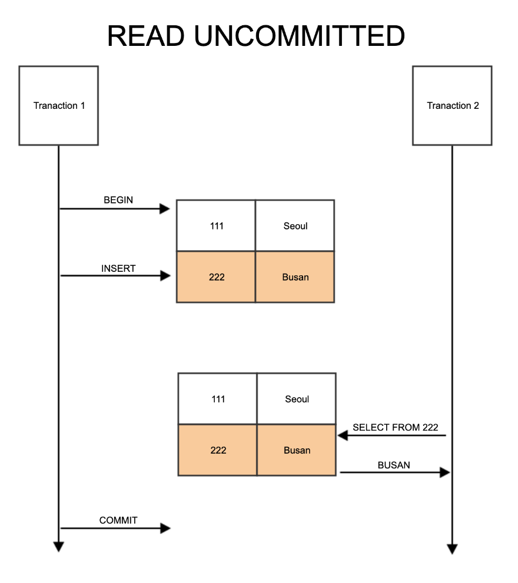
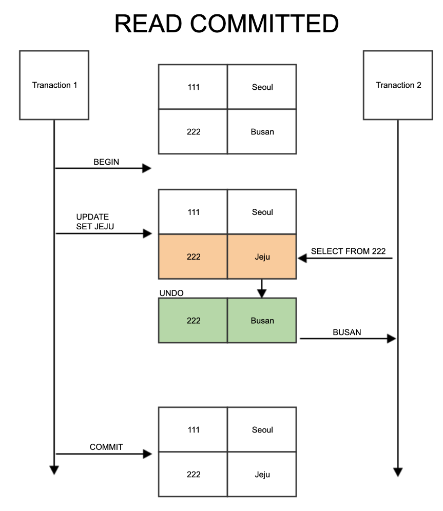
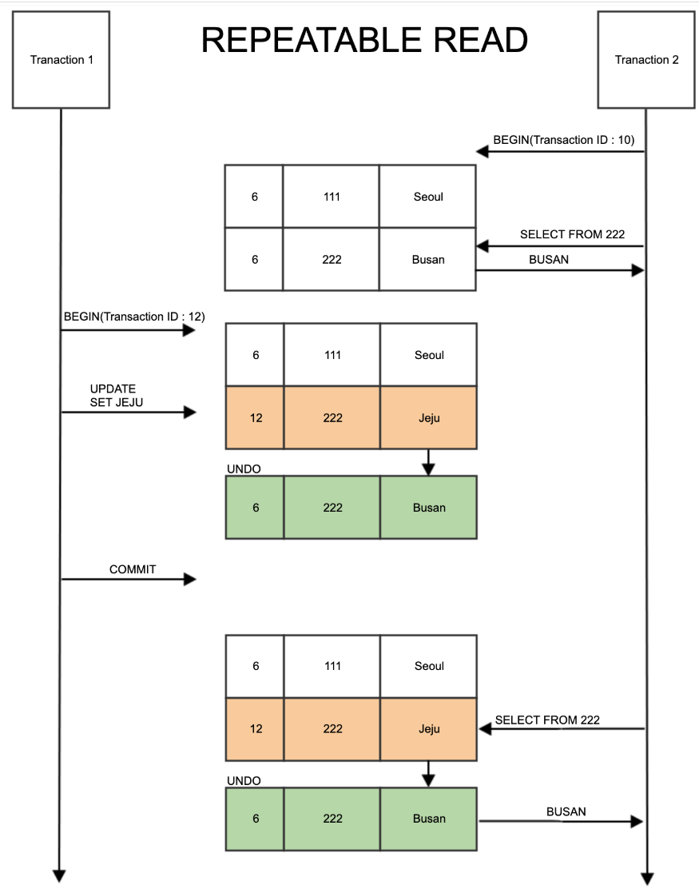
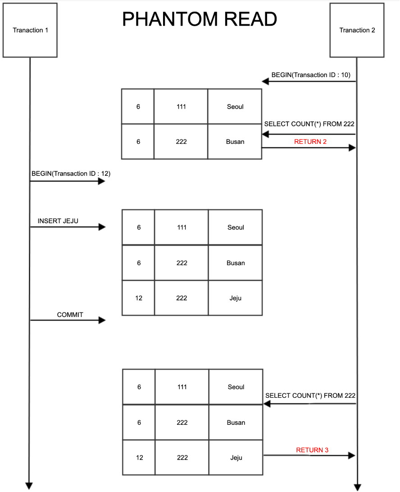

# DATABASE - 250206

## 1. 트랜잭션(Transaction)
- 트랜잭션(Transaction)은 데이터베이스에서 하나의 논리적인 작업 단위를 말한다.
- 여러 개의 SQL 문장을 하나의 작업 단위로 묶어서 실행하고, 문제가 발생하면 전체를 취소(Rollback)할 수 있도록 보장하는 개념이다.

#### 1. 트랜잭션의 4가지 특징 (ACID 원칙)
  1. Atomicity(원자성)
    - 트랜잭션은 모두 성공하거나, 모두 실패해야 한다.
    - 중간에 문제가 생기면 ROLLBACK으로 원상태로 되돌린다.
  
  2. Consistency (일관성)
    - 트랜잭션이 수행되면 데이터는 항상 일관된 상태를 유지해야 한다.
    - 예를 들면, 은행 계좌에서 돈을 이체할 때 'A 계좌에서 빠진 돈 = B 계좌로 들어간 돈'이어야 한다.
  
  3. Isolation (격리성)
    - 여러 트랜잭션이 동시에 실행될 때 서로 간섭하면 안 된다.
    - 트랜잭션이 완료되기 전까지 다른 트랜잭션에서 변경된 데이터를 볼 수 없어야 한다.
  
  4. Durability (지속성)
    - 트랜잭션이 성공적으로 수행되면, 데이터는 영구적으로 저장된다.
    - 데이터베이스가 갑자기 꺼져도 COMMIT된 데이터는 유지된다.
    
#### 2. 트랜잭션은 왜 배워야 할까?
  - 데이터 무결성 보장
  - 복잡한 데이터 변경을 안전하게 수행
  - 동시성 문제 해결

#### 3. 트랜잭션을 사용할 때 단점
  - 성능 저하 기능
    - 트랜잭션은 데이터를 안전하게 관리하지만, LOCK(잠금)이 발생하여 성능이 저하될 수 있음
    - 너무 긴 트랜잭션은 데이터베이스의 응답 속도를 느리게 만들 수 있음
  - 복잡성 증가
    - 단순한 SELECT 문에서는 트랜잭션이 필요 없지만, 복잡한 데이터 변경에서는 트랜잭션을 신중하게 설계해야 함

#### 4. 트랜잭션 격리 수준 (Transaction Isolation Level)
- 트랜잭션 격리 수준은 여러 트랜잭션이 동시에 실행될 때, 서로 간섭하는 정도를 조절하는 설정이다.
  - 트랜잭션이 실행되는 동안 다른 트랜잭션이 데이터를 볼 수 있는지, 수정할 수 있는지 결정함
  - 높은 격리 수준일수록 데이터 무결성이 보장되지만, 성능 저하가 발생할 수 있음

- 트랜잭션에서 발생할 수 있는 문제
  1. Dirty Read
    - 하나의 트랜잭션이 아직 COMMIT 되지 않은 데이터를 읽는 문제
    - 이후 해당 트랜잭션이 ROLLBACK되면, 읽은 데이터가 사라짐
    - 잘못된 데이터를 읽을 가능성이 있음
  
  2. Non-Repeatable Read
    - 같은 데이터를 두 번 읽었을 때, 값이 다르게 나오는 문제
    - 트랜잭션이 데이터를 읽는 도중, 다른 트랜잭션이 해당 데이터를 변경하고 COMMIT하면 발생
  
  3. Phantom Read
    - 트랜잭션이 특정 조건을 만족하는 행을 조회했을 때, 다른 트랜잭션이 행을 추가 또는 삭제하여 결과가 달라지는 문제

      |격리수준|Dirty Read 방지|Non-Repeatable Read 방지|Phantom Read 방지|성능|
      |---|---|---|---|---|
      |READ UNCOMMITED|X|X|X|빠름|
      |READ COMMITED|O|X|X|보통|
      |REPETABLE READ(기본값)|O|O|X|보통(추천)|
      |SERIALIZABLE|O|O|O|느림|

- 트랜잭션 격리 수준
  1. READ UNCOMMITTED (읽기 미확정)
    - 가장 낮은 격리 수준, Dirty Read 발생 가능
    - 다른 트랜잭션이 COMMIT 하지 않은 데이터를 읽을 수 있음
    - 데이터 무결성이 깨질 가능성이 높음
    - 일반적으로 잘 사용되지 않음

    ```SQL
      SET TRANSACTION ISOLATION LEVEL READ UNCOMMITTED;
    ```

    
  
  2. READ COMMITED (읽기 확정)
    - Dirty Read 방지 - 단, Non-Reapeatable Read 발생 가능
    - 같은 데이터를 두 번 조회하면 값이 달라질 수 있음
    - Oracle DB의 기본 격리 수준

    ```SQL
      SET TRANSACTION ISOLATION LEVEL READ COMMITTED;
    ```

    
  
  3. REPEATABLE READ (반복 가능한 읽기)
    - Dirty Read 방지 + Non-Repeatable Read 방지 - 단, Phantom Read 발생 가능
    - 동일한 SELECT 쿼리를 실행해도 결과가 변하지 않음
    - MYSQL의 기본 격리 수준

    ```SQL
      SET TRANSACTION ISOLATION LEVEL REPEATABLE READ;
    ```

    
    


## 2. 잠금(Locking)
- 트랜잭션을 실행할 때 여러 사용자가 동시에 데이터를 변경하면 충돌이 발생할 수 있음
- MYSQL에서는 LOCK을 이용하여 데이터의 일관성을 보장함
- 즉, 여러 사용자가 동시에 같은 데이터를 조작할 때 데이터 무결성을 보장하는 기능
  - 공유 잠금 (Shared Lock, S Lock)
    - 다른 사용자가 READ는 가능하지만, WRITE는 불가능 (SELECT ... LOCK IN SHARE MODE)
  - 배타 잠금 (Exclusive Lock, X Lock)
    - 다른 사용자가 READ, WRITE 모두 불가능 (SELECT ... FOR UPDATE)

1. 공유 잠금 (Shared Lock, S Lock)
- 동시에 여러 트랜잭션이 데이터를 읽을 수 있음
- 읽기 중에는 다른 트랜잭션이 데이터를 수정할 수 없음
  ```SQL
    START TRANSACTION;
    SELECT * FROM accounts WHERE id = 1 LOCK IN SHARED MODE;
  ```
  - 이 트랜잭션이 실행되는 동안 다른 트랜잭션은 해당 데이터를 UPDATE 할 수 없음
  - 단, SELECT는 다른 트랜잭션에서도 실행 가능

2. 배타 잠금 (Exclusive Lock, X Lock)
- 배타 잠금이 걸린 데이터는 다른 트랜잭션이 읽거나 수정할 수 없음
- 트랜잭션이 끝날 때까지 다른 트랜잭션이 대기 상태가 됨
  ```SQL
    START TRANSACTION;
    SELECT * FROM accounts WHERE id = 1 FOR UPDATE;
  ```
  - 이 트랜잭션이 실행되는 동안 다른 트랜잭션은 해당 데이터를 UPDATE 할 수도, SELECT 할 수도 없음
  - 배타 잠금이 해제될 때까지 다른 트랜잭션은 대기해야 함

※ Deadlock (교착 상태)
  - 두 개 이상의 트랜잭션이 서로 상대방이 가진 잠금을 기다리면서 영원히 멈추는 상태
  ```SQL
    -- 트랜잭션 A
    START TRANSACTION;
    SELECT * FROM accounts WHERE id = 1 FOR UPDATE;
    SELECT * FROM accounts WHERE id = 2 FOR UPDATE;

    -- 트랜잭션 B
    START TRANSACTION;
    SELECT * FROM accounts WHERE id = 2 FOR UPDATE;
    SELECT * FROM accounts WHERE id = 1 FOR UPDATE; -- Deadlock 발생
  ```