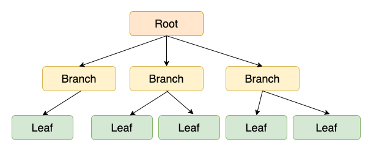

# DATABASE - 250213

## 1. 인덱싱 (Indexing)
- 인덱스는 테이블에서 데이터를 빠르게 찾을 수 있도록 돕는 자료구조
- 인덱스를 적절히 사용하면 데이터 조회 속도를 크게 향상시킬 수 있다.
- 다만, 비효율적인 인덱스 사용은 오히려 성능 저하를 초래할 수 있다.

#### 1. 인덱싱 사용 이유
  - 대용량 데이터 처리 : 데이터가 많아질수록 인덱스가 없으면 검색 속도가 느려짐
    - 데이터 검색 시 테이블 전체를 검색하는 것 보다 특정 키 값을 빠르게 찾을 수 있음
    - ex) O(N) -> O(log N)으로 성능 개선
  - 빠른 검색 속도 : WHERE, JOIN, ORDER BY, GROUP BY 등의 연산에서 성능 향상
  - 디스크 I/O 감소 : 불필요한 데이터 조회를 줄여 성능 최적화
  - 트랜잭션 처리 최적화 : 인덱스를 적절히 사용하면 Deadlock 가능성 감소

#### 2. 인덱스의 특징과 동작 원리
  1. 인덱스의 기본 개념   
    - 인덱스는 테이블의 특정 열에 대한 정렬된 데이터 구조   
    - 테이블 전체를 검색하는 Full Table Scan을 피할 수 있음   
    - 일반적으로 B-Tree(Balanced Tree) 구조를 사용   
    - SELECT 성능 향상 VS INSERT, UPDATE, DELETE 속도 저하 (인덱스 갱신 필요)   
  
  2. 인덱스의 특징   
    1. 검색(조회) 속도 향상 : 특정 값을 검색할 때, 테이블 전체를 탐색하는 것이 아니라 인덱스를 이용하여 빠르게 조회한다.   
    2. 정렬 최적화 : ORDER BY, GROUP BY 등의 연산이 인덱스를 활용하면 훨씬 빨라짐   
    3. 조인 최적화 : JOIN 연산 시 인덱스를 사용하면 테이블 간 매칭 속도 향상   
    4. 삽입/수정/삭제의 비용 증가 : 인덱스를 유지하기 위한 추가적인 연산이 필요함   

#### 3. 인덱스의 종류
1. 기본 인덱스 유형
    1) B-Tree Index (기본 인덱스)
        - 대부분의 DB에서 기본적으로 사용 (MySQL, PostgreSQL, Oracle, SQL Server etc)
        - 균형 트리 구조로 되어 있어 탐색 성능이 뛰어남
        - 범위 검색, 정렬된 데이터 검색에 강점

    2) Hash Index
        - 키-값 기반 검색에 유리
        - 같다 조건에 최적화되어 있음 (WHERE col = value)
        - 범위 검색, 정렬 검색에는 부적합
    
    3) Full-Text Index
        - 텍스트 검색을 빠르게 수행할 수 있도록 설계
        - 단어의 유사도 검색이 가능 (LIKE 연산보다 효율적)
    
    4) Bitmap Index
        - 값의 개수가 적은 컬럼에 적합 (성별, 지역코드 등)
        - 공간 효율성이 뛰어나지만, UPDATE가 많은 테이블에는 비효율적
    
2. 고급 인덱스 유형
    1) Composite Index (복합 인덱스)
        - 여러 개의 컬럼을 하나의 인덱스로 생성
        - WHERE col1 = value AND col2 = value 같은 복합 검색에 유리
    
    2) Covering Index (커버링 인덱스)
        - 쿼리에서 필요한 모든 데이터를 인덱스에서 찾을 수 있도록 설계
        - SELECT 문 실행 시 테이블을 조회할 필요 없이 인덱스에서만 결과를 가져올 수 있음
    
    3) Clustered Index (클러스터형 인덱스)
        - 데이터 자체가 인덱스에 포함됨
        - 기본 키(PK)가 자동으로 클러스터형 인덱스로 지정됨
        - 하나의 테이블에 하나만 존재 가능
    
    4) Non-Clutered Index (비클러스터형 인덱스)
        - 데이터는 원본 테이블에 유지되고, 인덱스는 별도 저장됨
        - 하나의 테이블에 여러 개의 비클러스터형 인덱스를 가질 수 있음

---
## 2. B-Tree Index
#### 1. Page
  - B-Tree를 이해하기 위해 페이지 개념이 선행되어야 한다. (B-Tree가 디스크 기반 데이터 구조이기 때문)
  - 페이지는 디스크에서 데이터를 읽고 쓰는 최소 단위
  - CPU가 직접 디스크에서 데이터를 읽을 수 없기 때문에, 디스크 -> 메모리로 데이터를 로드할 때 일정한 크기의 블록 단위로 가져오는 것을 페이지라고 한다.
  - B-Tree는 한 번의 디스크 접근으로 최대한 많은 데이터를 가져오도록 노드 크기를 페이지 크기와 맞추는 방식을 사용
  - 노드 하나가 페이지 하나와 대응되므로, 한 번의 페이지 로드로 여러 개의 키를 한 번에 검색할 수 있도록 하여 디스크 접근 횟수를 줄이는 것이 핵심

  - 핵심 내용   
    - 페이지는 디스크에서 데이터를 읽고 쓰는 최소 단위이며, CPU와 디스크 간 데이터 전송의 기본 단위임.
    - B-Tree는 디스크에서 데이터를 효율적으로 검색하도록 설계되었으며, 페이지 단위로 노드를 저장하여 디스크 접근을 최소화하는 방식을 사용함.

#### 2. B-Tree의 핵심 개념
  - 하나의 노드가 여러 개의 키와 자식 노드를 가진다.
  - 모든 리프 노드는 같은 깊이를 유지한다. (균형트리)
  - 노드의 키 값들은 오름차순으로 정렬된다.
  - 특정 키를 찾을 때 O(log n) 시간 복잡도를 가진다. (이진 탐색 기반)

2. B-Tree의 구조
    - B-Tree는 여러 개의 노드로 구성되며, 크게 루트, 내부 노드, 리프로 구분된다.

3. B-Tree 동작 과정
    1. 검색 (Search)   
        - 루트 노드에서부터 시작하여, 키 값이 어디 있는지 이진 탐색을 통해 찾음.
        - 키가 현재 노드에 있으면 반환, 없으면 해당 키가 포함될 수 있는 자식 노드로 이동하여 다시 탐색.
        - 디스크 접근을 최소화하기 위해 한 번의 디스크 I/O로 한 노드(즉, 하나의 페이지)를 읽어와서 탐색.
    2. 삽입 (Insertion)
        - 키를 삽입할 적절한 리프 노드를 찾음.
        - 리프 노드에 공간이 있다면 그대로 삽입.
        - 만약 리프 노드가 가득 찼다면(m-1개의 키를 초과하면), 노드를 분할(Split)하여 부모 노드로 키를 올림.
        - 부모 노드도 가득 차 있다면 재귀적으로 분할을 반복하여 루트까지 전파될 수 있음.
        - 만약 루트가 분할되면, 트리의 높이가 증가함.
    3. 삭제 (Deletion)
        - 키가 리프 노드에 있다면, 바로 삭제.
        - 만약 삭제로 인해 노드가 최소 키 개수보다 적어지면, 형제 노드에서 키를 빌려오거나(재배치) 형제 노드와 병합(Merge)하여 균형을 유지.
        - 병합이 루트까지 전파되면 트리의 높이가 줄어들 수도 있음.

4. B-Tree의 한계점
  - 삽입/삭제 시 분할과 병합 연산이 발생하여 성능 저하 가능
  - 대량의 INSERT, DELETE가 이루어지면 인덱스 조각화(Fragmentation)가 발생하여 성능 저하

