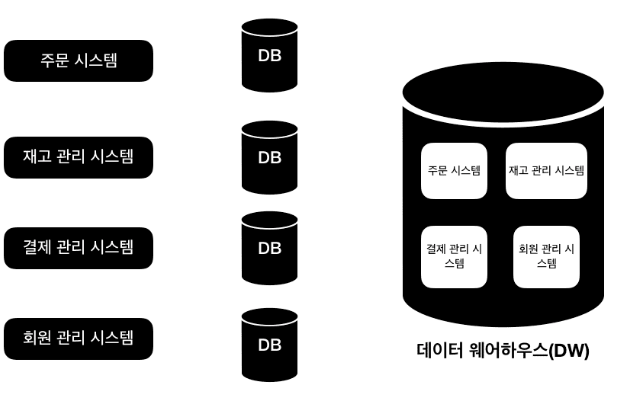
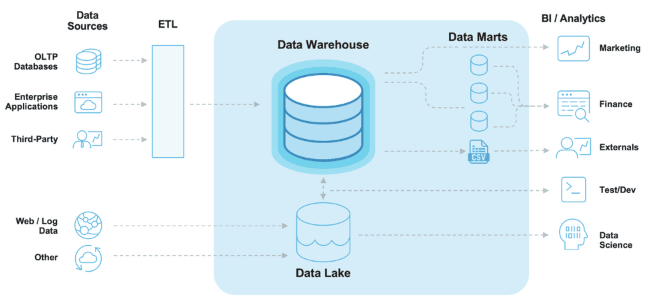
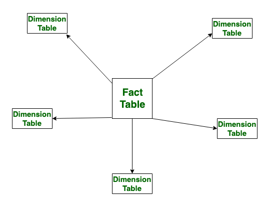
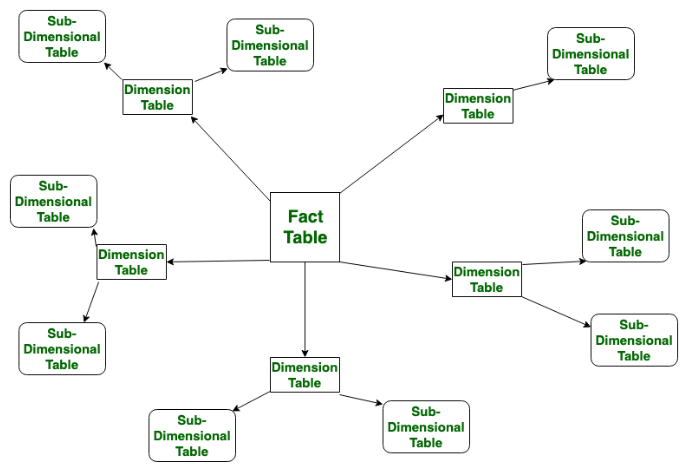

# DATABASE - 250220

## 1. 데이터 웨어하우스(DWH)

- 데이터 웨어하우스는 사용자의 의사 결정에 도움을 주기 위하여, 기간시스템의 데이터베이스에 축적된 데이터를 공통의 형식으로 변환해서 관리하는 데이터베이스를 말한다.
  

- 데이터 웨어하우스는 기업의 다양한 데이터 소스에서 데이터를 수집, 저장, 관리하고 분석할 수 있도록 설계된 중앙 집중형 저장소

- 데이터 웨어하우스는 주로 비즈니스 인텔리전스(BI), 데이터 분석, 데이터 마이닝 등에 활용

#### 1. OLTP vs OLAP
- OLTP : Online Transaction Processing -> 일반적인 운영 데이터 베이스 
- OLAP : Online Analytical Processing -  온라인 분석 처리 데이터 베이스

  |구분|OLTP(온라인 트랜잭션 처리)|OLAP(온라인 분석 처리)|
  |---|---|---|
  |목적|빠른 트랜잭션 처리|데이터 분석 및 의사 결정|
  |사용자|일반 사용자 (고객, 직원)|데이터 분석가, 관리자|
  |작업 유형|CRUD 작업|SELECT, GROUP BY, JOIN 등 복잡한 쿼리|
  |데이터 모델|정규화된 테이블 구조|비정규화된 다차원 모델(스타 스키마, 스노우플레이크 스키마)|
  |데이터 크기|상대적으로 작음(실시간 데이터 위주)|매우 큼 (과거 데이터 포함)|
  |응답 속도|빠름 (밀리초 단위)|상대적으로 느림 (대량 데이터 조회)|
  |예시|은행 계좌 거래, 온라인 주문 시스템|매출 분석, 고객 행동 분석|

#### 2. 데이터 웨어하우스의 필요성
  1. 여러 시스템의 데이터를 통합 (ERP, CRM, 웹 로그 등)
  2. 데이터 분석을 위한 최적화
  3. 과거 데이터 저장 및 추세 분석   
    - OLTP에서는 보통 최근 3개월 내 데이터를 관리   
    - 데이터 웨어하우스는 5년 치 데이터를 저장 및 분석   
  4. 데이터 품질 및 일관성 유지   
    - 각 시스템에서 생성된 데이터는 형식이 다를 수 있음   
    - 데이터 웨어하우스에서는 ETL(추출, 변환, 적재) 과정에서 데이터를 표준화하고 정제하여 품질을 유지   

#### 3. 데이터 웨어하우스의 아키텍처
  

  1. 소스 시스템 (Source System)   
    - 운영 시스템(OLTP)에서 데이터를 가져옴 (ERP, CRM, 트랜잭션 DB 등)   
  2. ETL (Extract, Transform, Load)   
    - 데이터를 추출(Extract) -> 변환(Transform) -> 적재(Load)하는 과정   
    - 이 단계에서 데이터 클렌징, 중복 제거 등이 이루어짐   
  3. 데이터 웨어하우스 (DWH, Data Warehouse)   
    - 정형 데이터(Structured Data)를 저장하는 OLAP 시스템   
    - 분석용 데이터를 효율적으로 조회할 수 있도록 최적화됨   
  4. 데이터 마트 (Data Mart)   
    - 특정 부서(마케팅, 영업, 인사 등)에서 사용할 수 있도록 데이터를 분리   
    - 일반적으로 DWH보다 더 작은 규모   
  5. BI 도구 (Business Intelligence)   
    - Tableau, Power BI 같은 툴을 사용해 데이터 분석 및 시각화   
    
  
#### 4. 데이터 모델링 기법
  
1. 스타 스키마 (Star Schema)      
   
    - 스타 스키마는 하나의 사실 테이블(Fact Table)을 중심으로 여러 개의 차원 테이블(Dimension Table)이 직접 연결된 비정규화된 구조
    - 특징
      - 중앙에는 "Fact Table"이 존재 -> 핵심 데이터 저장
      - Fact Table은 여러 개의 Dimension Table과 직접 연결
      - Dimension Table은 중복을 포함할 수 있음 (비정규화)
      - Join 연산이 적어 빠른 데이터 조회가 가능

2. 스노우플레이크 스키마 (Snowflake Schema)

    - 스노우플레이크 스키마는 스타 스키마에서 차원 테이블을 추가 정규화하여 계층적 구조로 만든 형태
    - 특징
      - 차원 테이블을 정규화하여 세분화된 테이블로 분리
      - 데이터 중복이 최소화
      - 데이터 저장 공간을 절약할 수 있음
      - JOIN 연산이 많아지기 때문에 쿼리 성능이 느릴 수 있음

3. Star Schema vs Snowflake Schema

|항목|Star Schema|Snowflake Schema|
|---|---|---|
|구조|단순한 방사형 구조|정규화된 계층적 구조|
|차원 테이블|비정규화(중복포함)|정규화(세분화된 테이블)|
|데이터 중복|중복 존재|중복 최소화|
|쿼리 성능|빠름 (JOIN이 적음)|느릴 수 있음 (JOIN이 많음)|
|난이도|비교적 쉬움|구조가 복잡함|
|저장 공간|더 많이 사용됨|저장 공간 절약|
|사용 사례|BI 보고서, 빠른 분석이 필요한 경우|데이터 품질을 중요하게 여기는 경우|

