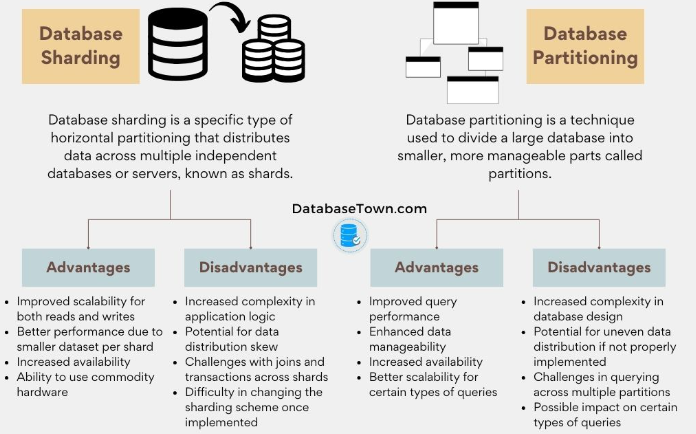

# DATABASE - 250220

## 1. Sharding

#### 1. Sharding 이란?
- Sharding은 대용량 데이터를 여러 개의 독립적인 데이터베이스 서버(Shard)에 분산 저장하는 기법이다.
- 즉, 하나의 거대한 데이터베이스를 여러 개의 작은 데이터베이스로 쪼개서 관리하는 방식이다.   
  -> 기존의 단일 데이터베이스의 한계를 극복하고 성능을 개선하는 것이 목표

#### 2. 기존 데이터 베이스의 한계
1. 단일 데이터베이스의 성능 문제
  - 트래픽과 데이터양이 증가할수록 데이터베이스 부하 증가
  - 인덱스 크기가 커지고 쿼리 속도가 느려짐
  - CPU, RAM을 늘려도 물리적인 한계에 부딪힘

2. Scale-Up의 한계
  - 서버의 스펙을 높이는 방법은 비용이 많이 들고 한계가 존재
    - Sharding은 Scale-Out으로 여러 서버를 활용하여 확장 가능

3. 고가용성 확보 필요
  - 단일 DB는 장애 발생 시 서비스 전체 중단
    - Sharding 시 특정 Shard만 영향 받음

#### 3. Sharding Strategies

1. Range Sharding
    - 데이터를 범위 기준으로 나누어 Shard에 저장   
      ex) User ID 1~1000 -> Shard A, 1001~2000 -> Shard B
    
    - 장점
      - Query가 특정 Shard에만 집중되어 빠름
      - 단순한 구현 가능
    
    - 단점
      - 특정 Shard에 데이터가 몰릴 가능성이 있음
      - 데이터 불균형 문제 발생
  

2. Hash Sharding
    - 데이터를 해시 함수를 이용해 Shard에 분산 저장   
      ex) Hash(User ID) % 3 -> Shard A, Shard B, Shard C
    
    - 장점   
      - 데이터가 균등하게 분배됨
      - 확장성이 뛰어남
    
    - 단점 특정 조건으로 데이터 조회 시, 모든 Shard를 탐색해야 할 수도 있음
    - Shard 개수를 변경하면 기존 데이터 재배치 필요

3. Directory Based Sharding
    - 미리 정해둔 특정 기준에 따라 데이터를 나누는 방식   
      ex) VIP 고객 -> Shard A, 일반 고객 -> Shard B
    
    - 장점
      - 비즈니스 로직과 연계하여 설계 가능
      - 특정 Shard에 집중적으로 최적화 가능
    
    - 단점
      - Shard가 늘어나면 관리 복잡성 증가
      - 특정 그룹에 트래픽이 몰릴 가능성이 있음

4. Geo Sharding
    - 사용자 지역에 따라 데이터를 분할하여 저장    
      ex) 한국 유저 -> 한국 데이터센터, 미국 유저 -> 미국 데이터센터
    
    - 장점
      - 네트워크 Latency 감소
      - 법적/보안 요구사항 충족 가능
    
    - 단점
      - 사용자 이동 시 데이터 접근이 비효율적일 수 있음

#### 4. Sharding vs Partitioning
    
  

  - Partitioning은 하나의 데이터 베이스 내에서 데이터를 나누어 관리하는 것
  - Sharding은 여러 개의 데이터베이스로 데이터를 분산하는 것

    |상황|Partitioning|Sharding|
    |---|---|---|
    |하나의 데이터베이스로 충분한 경우|O|X|
    |데이터베이스 서버가 너무 켜져서 분산이 필요한 경우|X|O|
    |데이터를 쿼리할 때 특정 기준으로 분리하고 싶은 경우|O|X|
    |읽기/쓰기 성능을 모두 높이고 싶은 경우|X|O|
    |수평적 확장이 필요한 경우|X|O|

#### 5. Sharding의 핵심 설계 요소
  - Sharding을 설계할 때 가장 중요한 요소는 '데이터를 어떻게 나눌 것인가'
  
    1. Sharding Key
        - Sharding Key는 데이터를 분배할 기준이 되는 Column
        - Sharding Key가 잘못 선정되면 특정 Shard에 데이터가 몰리는 Hot Spot 문제 발생   
          ex) User ID, Order ID, Region 등
    
    2. Shard 크기 균형 유지
        - 데이터가 특정 Shard에 편중되지 않도록 설계해야 함
        - Hash Sharding을 사용하면 데이터 분포를 균등하게 만들 수 있음
    
    3. Shard 수의 결정
        - Shard를 너무 적게 설정하면 나중에 확장하기가 어려움
        - 너무 많으면 운영 및 관리 비용 증가
    
    4. Shard 간 Join 문제 해결
        - Shard 간 Join이 어렵기 때문에 어플리케이션 레벨에서 해결해야 할 수도 있음
        - 일부 시스템에서는 데이터 중복 저장으로 해결
    
    5. Shard Rebalancing 고려
        - 처음 Shard를 잘못 설계하면 데이터가 늘어날 때 Shard 추가가 어려워짐
        - 이를 방지하려면 동적인 Shard 할당이 가능한 설계가 필요

#### 6. Sharding Test

  1. MySQL Shard 생성
  ```SQL
    -- Shard 1 데이터베이스 생성
    CREATE DATABASE shard1;
    USE shard1;
    CREATE TABLE users (
        id INT PRIMARY KEY,
        name VARCHAR(100)
    );

    -- Shard 2 데이터베이스 생성
    CREATE DATABASE shard2;
    USE shard2;
    CREATE TABLE users (
        id INT PRIMARY KEY,
        name VARCHAR(100)
    );

    -- Shard 3 데이터베이스 생성
    CREATE DATABASE shard3;
    USE shard3;
    CREATE TABLE users (
        id INT PRIMARY KEY,
        name VARCHAR(100)
    );
  ```
    
  2. Python Code(Hash Sharding)
  ```python
  import pymysql
  import hashlib

  # MySQL 샤드 연결
  shard1 = pymysql.connect(host="localhost", user="root", password="password", database="shard1")
  shard2 = pymysql.connect(host="localhost", user="root", password="password", database="shard2")
  shard3 = pymysql.connect(host="localhost", user="root", password="password", database="shard3")

  # 샤드 리스트
  shards = [shard1, shard2, shard3]

  # 해시 기반 샤딩 함수
  def get_shard(user_id):
      shard_index = int(hashlib.md5(str(user_id).encode()).hexdigest(), 16) % len(shards)
      return shards[shard_index]

  # 데이터 삽입 함수
  def insert_user(user_id, name):
      shard = get_shard(user_id)
      cursor = shard.cursor()
      cursor.execute("INSERT INTO users (id, name) VALUES (%s, %s)", (user_id, name))
      shard.commit()

  # 샘플 데이터 삽입
  insert_user(101, "Alice")
  insert_user(202, "Bob")
  insert_user(303, "Charlie")

  print("데이터 삽입 완료!")
  ```

  ```python
  # 데이터 조회 함수
  def get_user(user_id):
      shard = get_shard(user_id)
      cursor = shard.cursor()
      cursor.execute("SELECT * FROM users WHERE id = %s", (user_id,))
      user = cursor.fetchone()
      if user:
          print(f"User found: ID={user[0]}, Name={user[1]}")
      else:
          print("User not found.")

  # 유저 데이터 확인
  get_user(101)  # Alice
  get_user(202)  # Bob
  get_user(303)  # Charlie
  ```