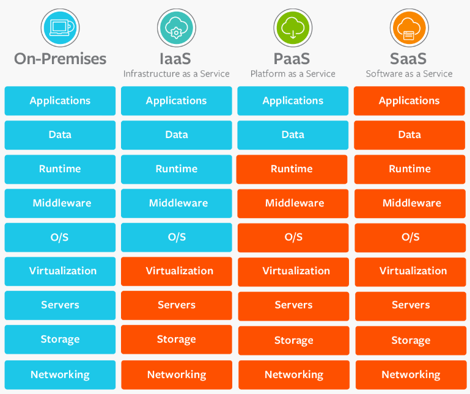

# DATABASE - 250320

# 클라우드 컴퓨팅(Cloud Computing)

## 1. 클라우드 컴퓨팅이란?  
- 클라우드 컴퓨팅(Cloud Computing) 은 인터넷을 통해 서버, 저장소, 데이터베이스, 네트워크, 소프트웨어 등을 제공하는 기술을 의미
- 사용자는 직접 서버를 구축하지 않고 필요한 만큼의 컴퓨팅 자원을 빌려 사용
- 기존 온프레미스(On-Premise) 환경에서 직접 서버를 운영하던 방식과 다르게, 클라우드는 유연성과 확장성이 뛰어난 환경을 제공

- 장점
  - 서버를 직접 운영할 필요 없이, 비용 절감 + 유지보수 부담 감소
  - 확장성이 뛰어나며 필요할 때만 자원을 추가할 수 있음
  - 최신 기술(컨테이너, 서버리스, AI 등)과 함께 사용 가능

## 2. 클라우드 컴퓨팅의 3가지 핵심 특징  

1. 온디맨드(On-Demand) 사용  
   - 사용자가 필요할 때 즉시 서버, 스토리지, 네트워크 등의 자원을 생성하고 제거할 수 있음  

2. 확장성(Scalability) 지원  
   - 트래픽이 증가하면 자동으로 서버를 추가(Scale-out) 하거나, 기존 서버의 성능을 높임(Scale-up)  

3. 사용한 만큼만 비용 청구
   - 하드웨어를 구매하는 것이 아니라, 사용한 리소스에 대해서만 요금을 지불하는 방식  

## 3. 클라우드 컴퓨팅의 3가지 서비스 모델 (IaaS, PaaS, SaaS)  

| 서비스 모델 | 설명 | 대표적인 서비스 | 사용 예시 |
|------------|----------------------|-----------------|----------------------|
| IaaS (Infrastructure as a Service) | 서버, 네트워크, 스토리지 같은 IT 인프라를 제공하는 서비스 | AWS EC2, GCP Compute Engine, Azure VM | 가상 서버, 스토리지 사용 |
| PaaS (Platform as a Service) | 애플리케이션 개발을 위한 플랫폼 제공 | AWS Elastic Beanstalk, Google App Engine | 개발자가 코드만 업로드하면 자동 실행 |
| SaaS (Software as a Service) | 소프트웨어를 인터넷을 통해 제공 | Google Drive, Gmail, Dropbox | 사용자에게 최종 소프트웨어 제공 |

- IaaS → PaaS → SaaS로 갈수록 관리 부담이 줄어들고, 사용이 간편해짐  

  

## 4. 클라우드 컴퓨팅의 배포 모델 (Public, Private, Hybrid)  

| 배포 모델 | 개념 | 장점 | 단점 |
|------------|----------------|--------------------|--------------------|
| 퍼블릭 클라우드 (Public Cloud) | 클라우드 서비스 제공업체(AWS, GCP, Azure)가 제공하는 서비스 | 초기 비용이 없음, 유지보수 필요 없음 | 보안이 상대적으로 낮음 |
| 프라이빗 클라우드 (Private Cloud) | 기업 내부에서 자체적으로 구축한 클라우드 | 보안성이 높음, 맞춤형 설정 가능 | 비용이 높고, 유지보수가 필요 |
| 하이브리드 클라우드 (Hybrid Cloud) | 퍼블릭 + 프라이빗 클라우드를 조합하여 사용 | 성능과 보안의 균형 유지 | 설정이 복잡하고 운영 비용이 높음 |

- 일반적인 스타트업, 기업 → 퍼블릭 클라우드 사용 (AWS, GCP, Azure)  
- 보안이 중요한 금융, 병원, 군사 기관 → 프라이빗 클라우드 구축  
- 일부 데이터는 퍼블릭 + 민감한 데이터는 프라이빗 활용 → 하이브리드 클라우드 사용  

## 5. 클라우드 컴퓨팅의 핵심 기술  

### 1. 가상화 (Virtualization)  
- 하나의 물리적 서버에서 여러 개의 가상 서버(VM, Virtual Machine)를 생성하여 실행하는 기술.  
  - 하이퍼바이저(Hypervisor) → 가상 서버를 관리하는 소프트웨어 (예: VMware, KVM)  
  - 컨테이너(Container) → 가상화보다 가볍고 빠른 실행 환경 제공 (예: Docker, Kubernetes)  

### 2. 컨테이너 기술 (Docker & Kubernetes)  
- 컨테이너(Container)는 애플리케이션을 패키징하여 빠르게 배포하는 기술  
  - Docker → 애플리케이션을 컨테이너로 실행  
  - Kubernetes(K8s) → 여러 개의 컨테이너를 자동으로 관리하는 시스템  

- 기존 방식: 서버에 직접 애플리케이션을 설치 → 환경 설정이 어려움  
- 컨테이너 방식: 어디서든 동일한 실행 환경 보장 → 배포가 빠르고 관리가 쉬움  
- 컨테이너를 활용하면 애플리케이션을 쉽게 배포하고, 관리할 수 있음  

### 3. 서버리스(Serverless)  
- 서버를 직접 관리할 필요 없이, 클라우드에서 자동으로 실행해주는 서비스  
  - AWS Lambda → 이벤트 발생 시 자동으로 코드 실행  
  - Google Cloud Functions → 서버 없이 함수(Function) 단위로 실행  

- 기존 방식: 서버를 직접 운영해야 함  
- 서버리스 방식: 서버 없이 코드만 배포하면 클라우드가 실행  
- 서버리스(Serverless)는 비용 절감 & 관리 부담을 줄여주는 최신 기술  

## 6. 클라우드 보안

- IAM (Identity & Access Management) → 사용자 접근 권한을 관리  
- 네트워크 보안 (VPC, Firewall) → 클라우드 내부 네트워크 격리  
- 데이터 암호화 (Encryption) → 저장된 데이터와 전송 데이터를 암호화  
- DDoS 방어 (Cloudflare, AWS Shield) → 대량의 트래픽 공격을 차단  
- 클라우드 보안을 강화해야 해킹 및 데이터 유출을 방지할 수 있음  

## 7. 클라우드 컴퓨팅의 장단점  

| 장점 | 단점 |
|------------------|------------------|
| 초기 투자 비용 없음 | 인터넷 연결이 필수적 |
| 확장성이 뛰어남 | 데이터 프라이버시 이슈 |
| 유지보수 부담 없음 | 장기적으로 비용이 증가할 수도 있음 |
| 장애 발생 시 자동 복구 | 특정 클라우드 벤더에 종속될 가능성 |

## # 클라우드 컴퓨팅 활용 사례  
- Netflix → AWS 클라우드를 활용하여 전 세계 스트리밍 서비스 제공  
- Spotify → Google Cloud를 활용하여 음악 스트리밍 최적화  
- NASA → AWS를 활용하여 우주 데이터 분석 수행  
- 스타트업 → 클라우드 기반으로 빠르게 서비스를 구축하고 확장   
